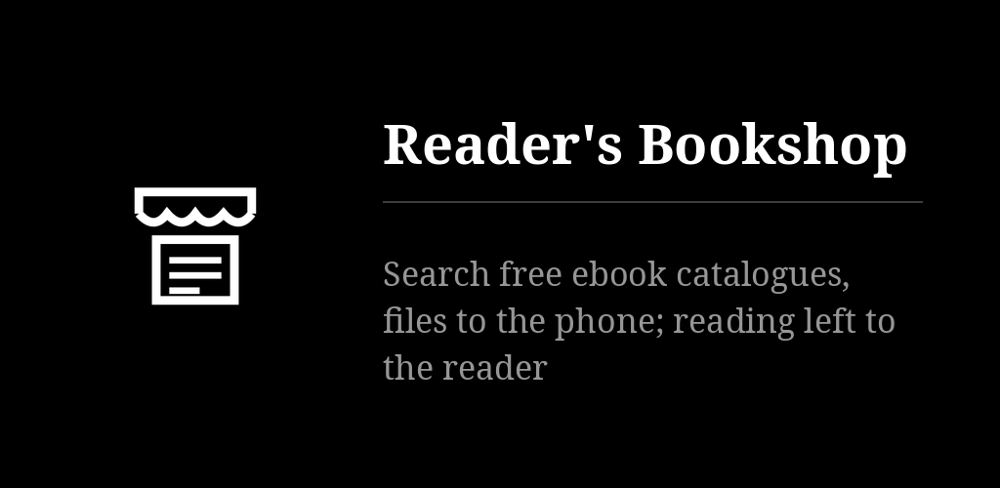

# Reader's Bookshop

Searches the public-domain libraries for free e-books, all at once, and downloads the file.
It does not read: the file goes to [Reader's Books](https://github.com/funkypitt/readers-books)
or any reader. Says whether the author has been dead seventy years when the source gives the
dates. Hosts nothing, no account. Black and white, text only.

## Key points

* Pick a language, type a title or an author, tick the box that says you will only take what
  you may: every source for that language is asked at once. A source that does not answer is
  simply missing, never an error.
* Tap a result for the formats offered and, when the dates are known, whether the seventy
  years of Swiss and European copyright have passed. The app says what it can and decides nothing.
* Files go to `Download/Reader's Bookshop`. Every line has a share arrow and a cross; the ⋯
  menu opens the folder, deletes everything after a confirmation, and leads to sources and settings.
* Sources: Project Gutenberg, Standard Ebooks, Wikisource, Bibliothèque numérique romande,
  Ebooks libres et gratuits, textos.info, the Internet Archive (freely downloadable texts only).
* Anna's Archive is off until you turn it on after reading what it is; a membership key, if
  any, gives the fast downloads.
* A search goes from the phone to the site, the file from the site to the phone; nothing else
  leaves the device. Responsibility for downloads is accepted at first start and ticked before every search.
* Six languages: English, French, German, Spanish, Portuguese, Russian. The sources screen
  tells how each source is used and what its terms allow; the research is in `SOURCES.md`.

More detail: [docs/NOTES.md](docs/NOTES.md).

## Install

From the [F-Droid repo](https://funkypitt.github.io/fdroid-repo/) or the APK attached to a
release.

## Build

`./gradlew assembleDebug` (JDK 17+, Android SDK 35). The live checks of the catalogues run
with `./gradlew testDebugUnitTest` and need the network.

## Crédits / Credits

© 2026 Pierre Gallaz. Développé avec [Claude Code](https://claude.com/claude-code) (Anthropic).
Licence MIT, voir `LICENSE`.

© 2026 Pierre Gallaz. Developed with [Claude Code](https://claude.com/claude-code) (Anthropic).
MIT licence, see `LICENSE`.

## Captures d'écran

