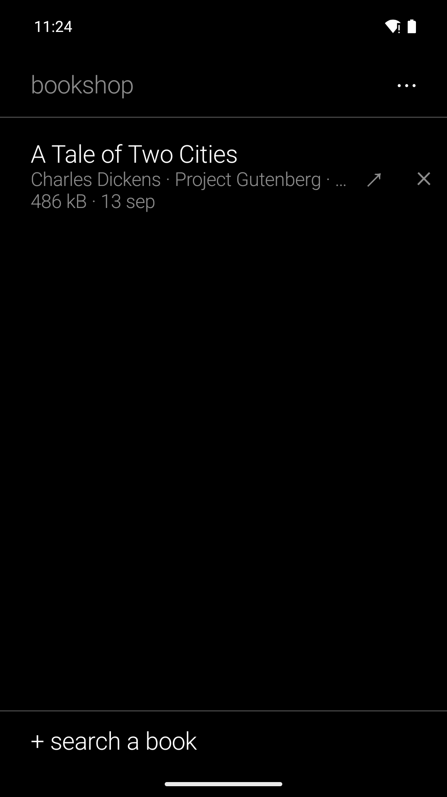

# Reader's Bookshop

A search-and-download app for free ebooks, black and white, in the family of
[Reader's Launcher](https://github.com/funkypitt/readers-launcher),
[Reader's Books](https://github.com/funkypitt/readers-books),
[Reader's Notes](https://github.com/funkypitt/readers-notes) and
[Reader's Calendar](https://github.com/funkypitt/readers-calendar). It finds a book, brings the
file to the phone and hands it to Reader's Books or to any reader; it does not read.

Pick a language, type a title or an author, tick the box that says you will only take what you
may, and every source for that language is asked at once. The sources that answer are listed
with their results; the ones that do not are simply missing, never an error. Tap a result to see
the formats offered and, when the source tells the author's dates, whether the seventy years of
Swiss and European copyright have passed. The file goes to `Download/Reader's Bookshop`, where
a file manager or a share to kDrive, Telegram or a reader can find it. Every line of the
bookshop has a share arrow and a cross; the ⋯ menu opens the folder, deletes everything after
a confirmation, and leads to the sources and the settings.

## Sources

Six languages: English, French, German, Spanish, Portuguese, Russian. Searched by the app:

- Project Gutenberg, through the OPDS catalogue it publishes for reading apps;
- Standard Ebooks (English);
- Wikisource in the six languages: the EPUB is assembled by the app from the pages;
- Bibliothèque numérique romande and Ebooks libres et gratuits (French), textos.info (Spanish),
  through their OPDS catalogues;
- the Internet Archive, freely downloadable texts only;
- Anna's Archive, off until the user turns it on after reading what it is. Its domains come
  from the Wikipedia article and are tested for speed; its browser check runs in a hidden
  WebView, or on screen when the site insists on a person; a membership key, if any, gives the
  fast downloads.

The sources screen lists, for each of them, how the app uses it and what its terms allow, and
a further list of sites left to the browser (Gallica, Projekt Gutenberg-DE, Cervantes Virtual,
Domínio Público, Lib.ru…). The research behind the list is in `SOURCES.md`.

## Terms

The app hosts nothing and keeps no account: a search goes from the phone to the site, the file
comes from the site to the phone. The user accepts once, at the first start, that the
responsibility for what is downloaded is theirs, and repeats it with a tick before every search.
Copyright differs by country; the app says what it can and decides nothing.

## Install

From the [F-Droid repo](https://funkypitt.github.io/fdroid-repo/) or the APK attached to a
release. Build with `./gradlew assembleDebug` (JDK 17+, Android SDK 35). The live checks of the
catalogues run with `./gradlew testDebugUnitTest` and need the network.

## Crédits / Credits

© 2026 Pierre Gallaz. Développé avec [Claude Code](https://claude.com/claude-code) (Anthropic).
Licence MIT, voir `LICENSE`.

© 2026 Pierre Gallaz. Developed with [Claude Code](https://claude.com/claude-code) (Anthropic).
MIT licence, see `LICENSE`.

## Captures d'écran

 
